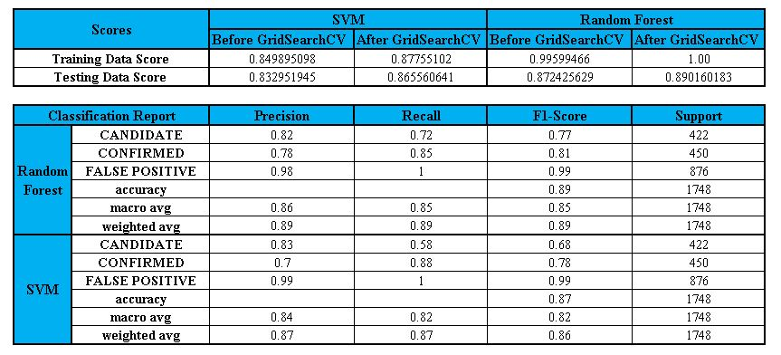

# Machine-Learning-Challenge

Over a period of nine years in deep space, the NASA Kepler space telescope has been out on a planet-hunting mission to discover hidden planets outside of our solar system.

Challenge is to create machine learning models capable of classifying candidate exoplanets from the exoplanet_data raw dataset 

The below process have been implemented to perform the challenge.

1. [Preprocess the raw data](#Preprocessing)
2. [Tune the models](#Tune-Model-Parameters)
3. [Compare two or more models](#Models-Used-for-Comparison)

### Preprocess the Data

* Preprocess the dataset prior to fitting the model.
* Perform feature selection and remove unnecessary features.
* Use `MinMaxScaler` to scale the numerical data.
* Separate the data into training and testing data.

### Tune Model Parameters

* Use `GridSearch` to tune model parameters.
* Tune and compare at least two different classifiers.

### Models Used for Comparison 

1. SVM Model
2. Random Forest Model

### Comparison

### Conclusion

After comparing the scores in both the models, Random Forest is better than Support Vector Machine.
